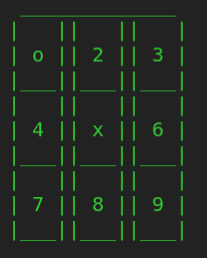

# TicTacToe++

Welcome to TicTacToe++, an improved version of the classic [Tic-tac-toe](https://en.wikipedia.org/wiki/Tic-tac-toe) game implemented in modern [C++](https://en.cppreference.com/w/). This project has undergone significant enhancements, including the incorporation of object-oriented programming principles and performance optimizations to provide a faster and more enjoyable gaming experience.

## How to Play

To get started, follow these simple steps:

1. Clone the repository to your local machine.

   ```bash
   git clone https://github.com/MohammadrezaAmani/TicTocToe.git
   ```

2. Compile the `src.cpp` file using your preferred C++ compiler (e.g., [gcc](https://gcc.gnu.org/)).

   ```bash
   g++ main.cpp -o TicTacToe
   ```

3. Run the compiled executable.

   ```bash
   ./TicTacToe
   ```

## Game Features

### Game Modes

Choose from multiple game modes to suit your preference:

- **Player vs Player (PvP):**
  Engage in a classic duel with your friend.

- **Player vs Computer (PvC):**
  Challenge the computer with advanced game logic.

- **Exit:**
  Quit the game whenever you wish.

### Game Interface

#### Game Menu


The game menu presents three buttons for selecting the desired mode.

#### Game Board


The game board features a 3x3 grid with interactive buttons to make your moves.

#### Selection


Enter the number of the button in the terminal to make your move.

#### End of the Game


Experience the thrill of victory, the agony of defeat, or the satisfaction of a tie.

## Project Details

As part of my university project, this TicTacToe++ implementation embraces modern programming practices, including object-oriented design, to deliver an improved gaming experience.

Feel free to explore the code, contribute, or provide feedback. Let's make TicTacToe++ even better together!
